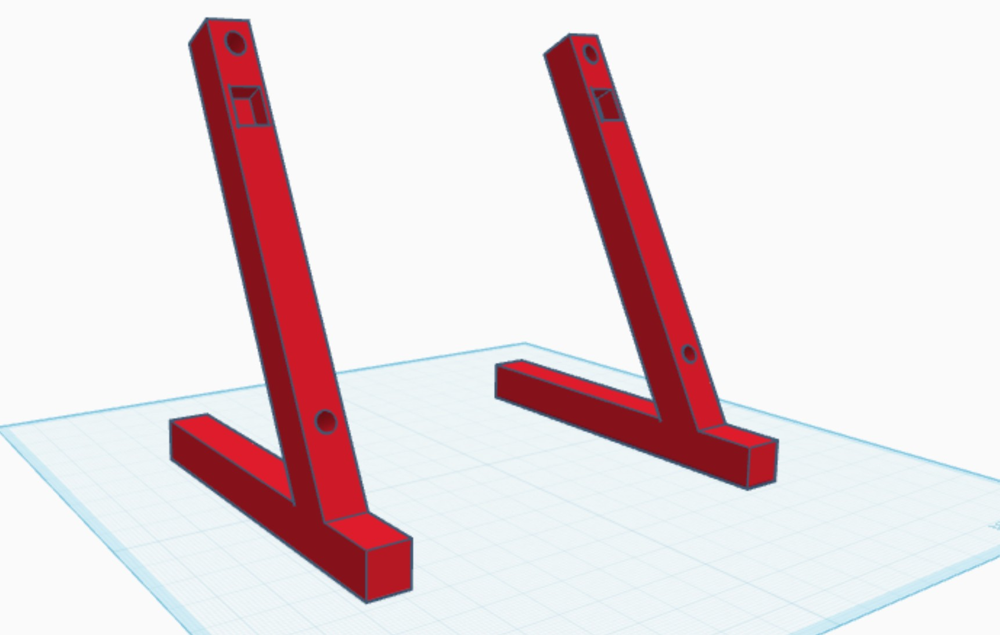
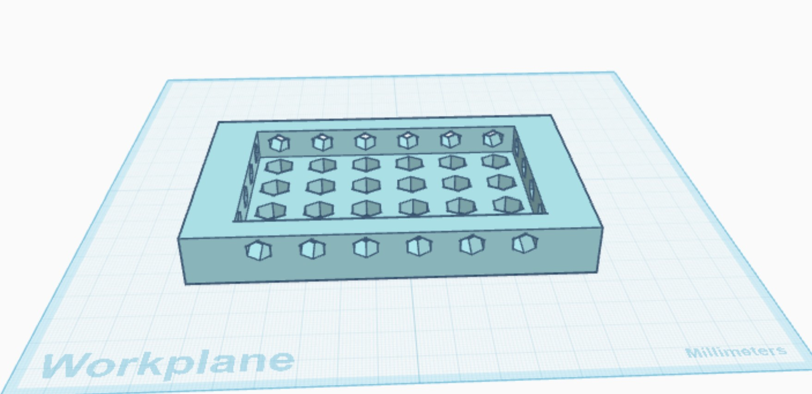
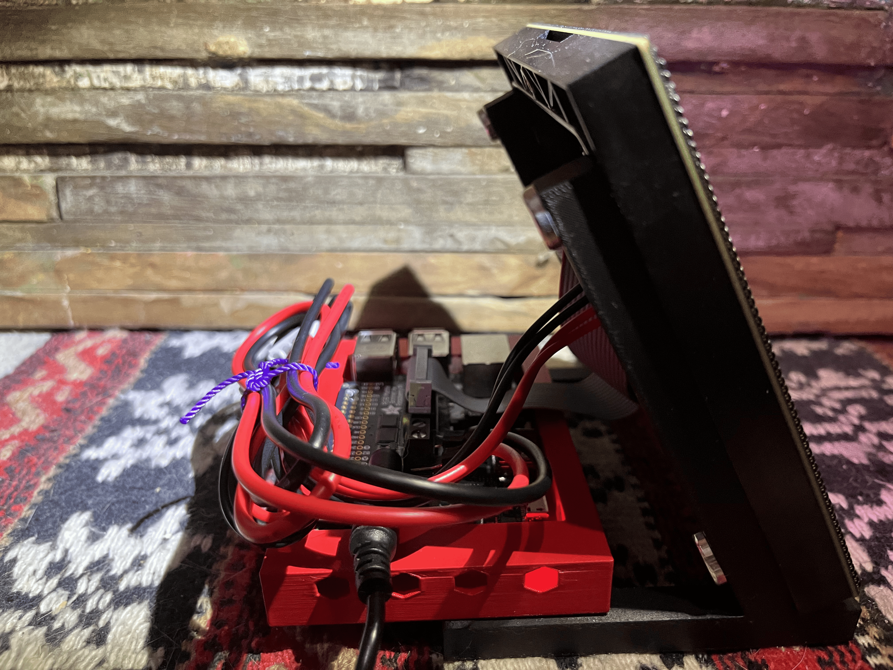
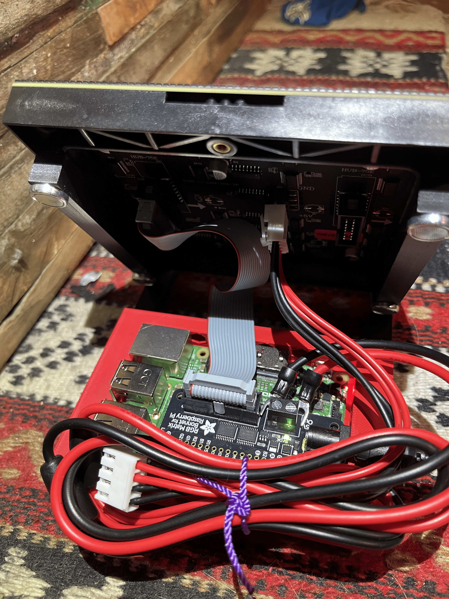

# LED-Spotify-Matrix
Using a 64x64 LED dot matrix, this project connects to your Spotify account and will display the album cover of the song you are currently listening in real time to as a rotating CD image.

# Hardware
- Raspberry Pi
- Adafruit RGB Matrix Bonnet
- 64x64 LED panel
- 5V Power supply
- Ribbon Cable
- MicroSD Card

# Setup
The project uses the Spotify Web API to retrieve the currently playing track and display its album artwork on the LED matrix.  
At a high level, the set up involves:  
- Creating a Spotify Developer App to obtain its API credentials
- Authorizing the app to access the currently playing track data
- Implementing Spotify's authentication to obtain access and refresh tokens
- Storing those tokens so the Python script can authenticate and refresh automatically  

The software uses several Python libraries to handle different parts of the project. The most notable being
- rgbmatrix - Controls and writes to the LED matrix
- Threading - Allows Spotify track updates and display operations to run concurrently, reducing lag on the display
- Pillow - Process and resizes the Spotify album artwork for the LED matrix

# Additional
For this project I 3D modeled a stand for the LED Matrix, along with a case for the Raspberry Pi that mounts on the back of the stand. The exact matrix I used was a 64x64 2mm pitch waveform Led Matrix ([Matrix Link](https://www.amazon.com/2048-Matrix-Adjustable-Brightness-Compatible/dp/B0BRBG71WS?crid=3U2IPXXK42OK2&dib=eyJ2IjoiMSJ9.4RL-284Rdnl7T7Dne0CUtnTT70pTEpl5SuwPy2Wp800KdTCPqk-B-sWpXiSWoGiyBmSv7VuJLc9sZOiFsp0_3JvdnbX--jNRQujoT3EKn9T621MIRBih6MoR0eLUD9967pnQGPrKv14fvFLiu5mCMsYh3zulY3JBCBzfMxDFBB_ziuVzzvQgPmVQrmVDXC-7.aNrDB8yv9l9W7kduIfUMEgWqiX8mcodHhvMwlxKFMaM&dib_tag=se&keywords=%E2%80%9CWaveshare%2B64x64%2BRGB%2BMatrix%2BP2.5&qid=1783545847&sprefix=%2Caps%2C302&sr=8-1&th=1)) and a Raspberry Pi 3 Model B+.  
> [LED Matrix Stand STL](hardware/LED_MATRIX_STAND.stl)  

> [Raspberry Pi Case STL](hardware/RASPBERRY_PI_CASE.stl) 

# Example of My Project

 

